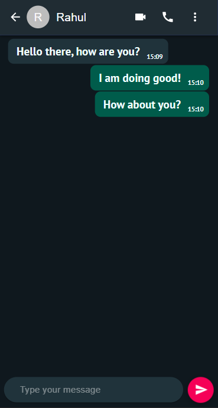

# A Chatting web-application

Built with React, Material-UI, and FireBase.

## Enter your name


## Add your friend


## Start Chatting!



## Features

- Two way messages.
- Can add new Contacts.
- Can send emojis too.

## Run Locally

Clone the project

```bash
  git clone https://link-to-project
```

Go to the project directory

```bash
  cd my-project
```

Install dependencies

```bash
  npm install
```

Start the server

```bash
  npm start
```
